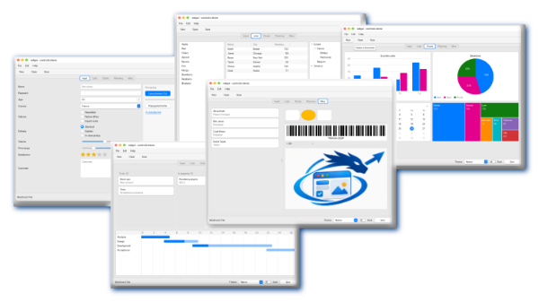
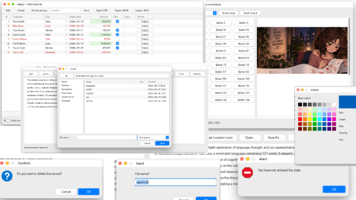
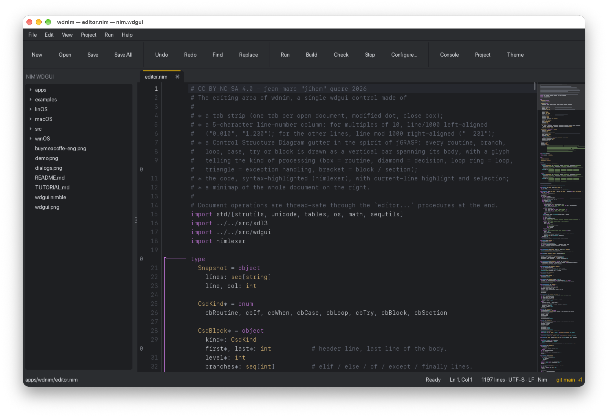
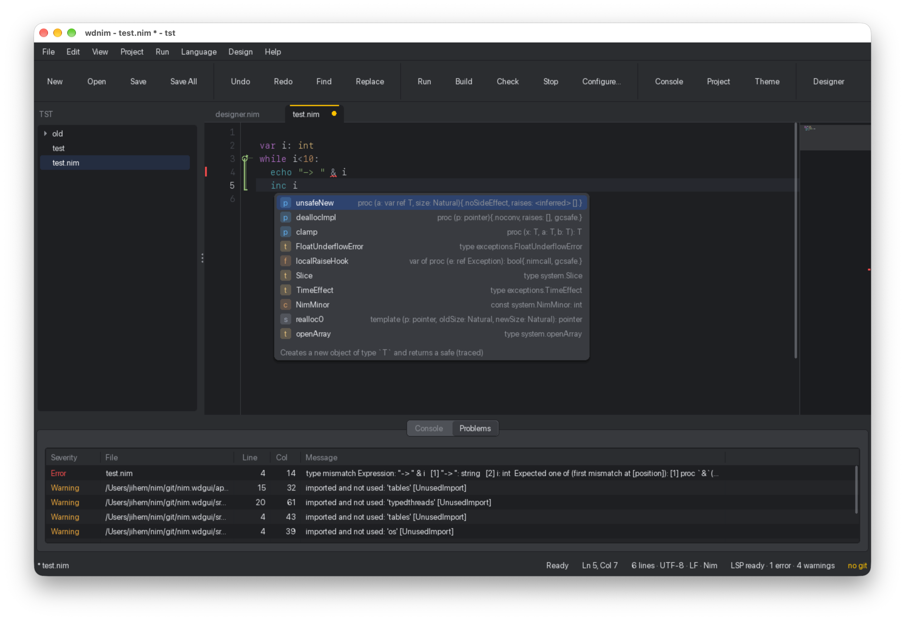
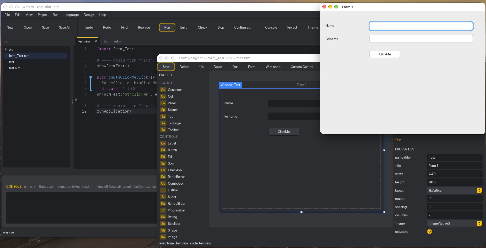
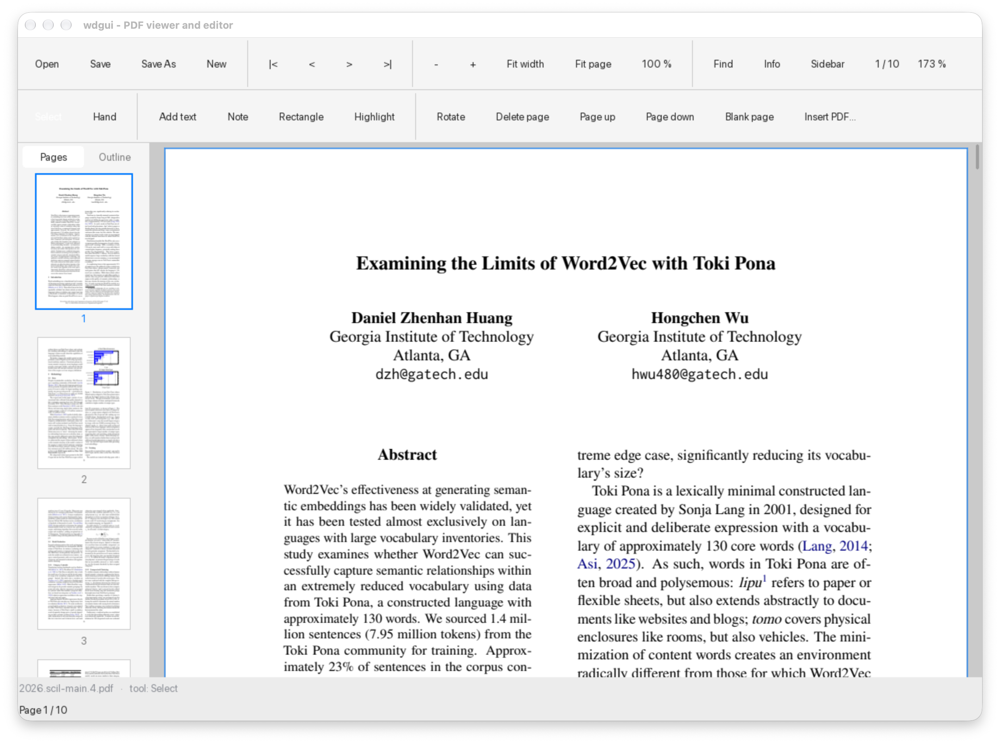

```
   _._
 o|- -|o This file is licensed under CC BY-NC-SA 4.0 international license.
  ( l )  To view a copy of this license, visit http://creativecommons.org/licenses/by-nc-sa/4.0/
    =    Author: jean-marc "jihem" quere 2026
```

[](https://lipunila.sonaliwan.fr)
## wdgui - WD-style controls for Nim, on SDL3
> Lab'Oratoire / Projet magenta - Laboratory of Cognitive and Social Psycholinguistics \
> https://lipunila.sonaliwan.fr - metalab(at)sonaliwan.fr

wdgui is a GUI library written in Nim on top of SDL3. It reproduces the usual native controls of desktop OS and the way you program them: one event handler per window that receives the control id and the event kind, properties read and written through getters and setters (`..Value`, `..Caption`, `..State`...), and WD-like functions such as `listAdd`, `tableAddLine`, `treeAdd` or `grAddData`. Indexes are 1-based and tree paths are TAB-separated.

New to the library? Start with **[TUTORIAL.md](TUTORIAL.md)**, a step-by-step getting-started course.

## Requirements

Nim 2.0 or later and SDL 3.2 or later. SDL3_ttf is optional but strongly recommended (without it text uses SDL's 8×8 bitmap font). SDL3_image is optional and adds PNG/JPG support. All libraries are loaded dynamically; no C headers are needed.

```
nim c -r --threads:on --mm:atomicArc -d:sdlttf examples/demo.nim
```
or
```
nimble demo
```
(from wdgui root folder which store `src` folder)

`--threads:on` is required. `--mm:atomicArc` makes reference counting safe across threads; the control tree is also protected by a global lock.

## Architecture in one paragraph

The UI thread reads SDL events, updates the visual state of controls and pushes `Event` objects onto a queue; it never runs user code, so the interface never freezes. A dispatcher thread pops the queue and, for each event, starts a dedicated thread that calls the window handler for the target control, then for each parent container, then for the window, unless `ev.stopPropagation()` is called. Handlers modify the interface through the thread-safe id-based API. On macOS the UI loop must run on the main thread (`runApplication()`); on Windows and Linux `runApplicationInBackground()` runs it on its own thread.

## Controls

Basic: Label (and link), Button (default, cancel, flat), Check Box (boxes or switch; value is a bit mask), Radio Button, Edit (text, integer, real, password, multiline, placeholder, clipboard), Spin, Progress Bar, Slider, Range Slider, Scrollbar, Rating, Shape, Image, Bar Code (Code 39).

Containers: Supercontrol, Cell, Tab, Splitter, Toolbar, Panel (scrollable, macOS-style scrollbars: always, automatic overlay or hidden), with seven layouts (absolute, vertical, horizontal, grid, flow, border, stack).

Lists: List Box (multi-selection), Combo Box, Table (header sorting, resizable columns), TreeView, Looper, Menu bar and context menus.

Data grid: Grid, a full data-entry table: typed columns (text, number, date, image, button, combo, check box) that are sub-controls, consultation or entry at grid / column / line / cell level, single or multiple selection, sorting, search, hidden / moved / resized columns, conditional formatting, breaks, footer aggregates, CSV and JSON import / export.

Dialog boxes (modal, in their own window, blocking the calling handler until closed): alert, confirm, prompt with stop / exclamation / question / information / custom icons, Open and Save As, Print and Page Setup, Color and Font, Find and Replace.

Charts and planning: Chart (column, line, area, pie), Calendar (value `"YYYYMMDD"`), Kanban (drag and drop), TreeMap, Gantt Chart.

Not covered: HTML, PDF viewer, Word processor, Spreadsheet, Camera, Conference, Multimedia, OLE/ActiveX/.NET, Map, Pivot table, Scheduler/Organizer, Org chart, Hierarchical table, Image list, Ribbon, Internal window, Dashboard. They can be added by subclassing `Control` (see the tutorial, step 9).

## Look & feel

`themeWindows11`, `themeMacOS` and `themeLinux` (GNOME/Adwaita), each light or dark, plus `themeNative()`. Switch at runtime with `winId.theme = themeMacOS(dark = true)`. Every `Theme` field can be edited, and each control has a `style` (background, text, border, accent, radius, border width) that overrides the theme.

[](https://buymeacoffee.com/sonaliwan.fr)

## Project layout

```
src/wdgui.nim                    entry module (import wdgui)
src/sdl3.nim                     SDL3 / SDL3_ttf / SDL3_image bindings
src/wdgui/colors_themes.nim      Color, Theme, Style, native themes
src/wdgui/drawing.nim            2D drawing primitives and text
src/wdgui/core.nim               Control, Container, Window, events, layouts, focus
src/wdgui/controls_basic.nim     basic controls and containers
src/wdgui/controls_lists.nim     list-type controls and popups
src/wdgui/controls_charts.nim    chart, calendar, kanban, treemap, gantt
src/wdgui/controls_grid.nim      the Grid control and its grid... API
src/wdgui/controls_panel.nim     the scrollable Panel and its panel... API
src/wdgui/dialogs.nim            modal dialog boxes
src/wdgui/application.nim        UI loop and threaded dispatcher
src/wdgui/api.nim                id-based WD-style API
examples/demo.nim                tour of every control
examples/custom_control.nim      subclassing example
examples/grid_demo.nim           the Grid control
examples/panel_demo.nim          scrollable panels
examples/dialogs_demo.nim        dialog boxes
```

### Version 1.3.0

+ Grid control
+ Panel control
+ Dialog boxes (alert, confirm, prompt, find, replace and file, printer, color and font selectors)

[](https://buymeacoffee.com/sonaliwan.fr)

### Version 1.3.1

Sample app, what's about a Nim editor ?
[](https://buymeacoffee.com/sonaliwan.fr)

## Known limitations

No anti-aliasing of shapes; bitmap font without `-d:sdlttf`; containers do not scroll (list-type controls do); no IME beyond SDL text input; no accessibility support. With the default thread-per-event mode, two close events may be handled out of order; use `dispatchMode = dmSequential` when order matters.

## Version 1.4.2 Wahou...

+ LSP

[](https://buymeacoffee.com/sonaliwan.fr)

+ Form designer & code generation

[](https://buymeacoffee.com/sonaliwan.fr)

Originally, wdnim was supposed to be a demonstration project showcasing the use of the wdgui library and... I think I got a little carried away. After adding the code editor, I felt the urge to include a file tree, a minimap, a process diagram, server integration for error feedback, code completion, and so on... until I came up with a somewhat crazy idea: why not add a designer that generates code into a dedicated file for each form? And why not have it generate the event-handling code as well? Today, I have reached a stage where wdnim is beginning to become a serious alternative for anyone wanting to develop applications in Nim.

When creating a new project, you need to copy the contents of src/wdgui into your project. The project therefore starts with sdl3.nim, wdgui.nim, the wdgui folder, and the linOS, macOS, or winOS folder corresponding to your environment. More experienced users can use Nimble to reference the wdgui package and configure a search path for locating the SDL3 library.

Honestly, I never thought I would get this far in such a short time. Nim is truly a remarkable language, extraordinarily efficient both in its expressiveness and in its execution speed. I'll try to improve a few usability aspects here and there. I'm also wondering whether integrating a Firebird or DuckDB driver (or perhaps both?) along with a few database-oriented components would be a worthwhile addition, as would a report designer capable of printing or exporting reports to PDF.

Ah... if only I could devote a little more time to it... and a little less time to working solely to keep the refrigerator stocked.

## Version 1.5.3

+ Add a PDF control (thanks to the [PDFium team](https://github.com/bblanchon/pdfium-binaries) for their help)

+ Adds an environment variable (WDGUI_PATH) to define the root directory for the `linOS`, `macOS`, and `winOS` folders, applicable to all applications using wdgui.

[](https://buymeacoffee.com/sonaliwan.fr)

### One more thing!
A small gesture that can - greatly - help us... \[Caffeine matters a lot for a team of neurodivergent folks: ASD, ADHD, GAD, HPI and/or THPI (members of **mensa.fr** and **triplenine.org**).\]

[](https://buymeacoffee.com/sonaliwan.fr)
